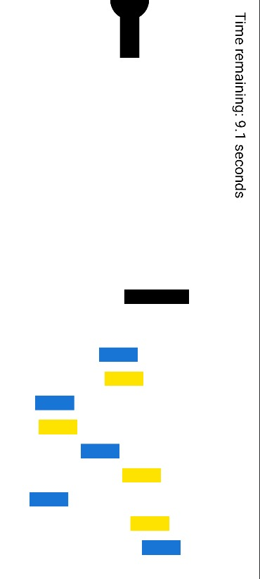

# Cannon Game 💣

Projeto desenvolvido em grupo, replicando o jogo de tiro ao alvo do livro "Android 6 for Programmers".

<p align="center">
  
</p>

## 👥 Integrantes do Grupo

| Nome Completo | GitHub |
| :--- | :-- |
| **[Bruno Rezende]** | [@BVRezende](https://github.com/BVRezende) |
| **[Guilherme Pereira]** | [@DevGuiPereira](https://github.com/DevGuiPereira) |
| **[Kawan Silva]** | [@ksilva-kwn](https://github.com/ksilva-kwn) |
| **[Pedro Vargas]** | [@PedroAngeloVargas](https://github.com/PedroAngeloVargas) |
| **[Pedro Teixeira]** | [@PedroTeixeira027](https://github.com/PedroTeixeira027) |

## 🎯 Objetivo do Projeto

Este projeto tem como objetivo principal a obtenção de nota para aprovação na disciplina de **Programação III**. 
O software consiste na implementação prática dos conceitos de desenvolvimento mobile praticados em aula.

## 🚀 Funcionalidades Implementadas

[cite_start]O jogo foi desenvolvido seguindo estritamente as especificações do **Capítulo 6** do livro *Android 6 for Programmers*, incluindo:

* [cite_start]**Mecânica de Tiro:** Disparo de balas de canhão ao tocar na tela, calculando ângulo e trajetória baseados na posição do toque.
* [cite_start]**Detecção de Colisão:** Implementação lógica para verificar colisões entre a bala, o bloqueador (obstáculo) e os alvos.
* **Sistema de Tempo:**
    * O jogo possui um limite de tempo (contagem regressiva).
    * [cite_start]**Bônus:** Acertar um alvo adiciona 3 segundos ao tempo.
    * [cite_start]**Penalidade:** Acertar o bloqueador (barreira) subtrai 2 segundos do tempo.
* [cite_start]**Efeitos Sonoros:** Utilização de `SoundPool` para reproduzir sons de disparo, vidro quebrando (acerto no alvo) e impacto no bloqueador.
* [cite_start]**Animação Frame-a-Frame:** Uso de `SurfaceView` e uma `Thread` dedicada para desenhar os gráficos e atualizar a posição dos elementos (Game Loop) sem travar a interface do usuário.
* [cite_start]**Immersive Mode:** O jogo ocupa a tela inteira, ocultando as barras de sistema do Android para maior imersão.

## 🛠️ Tecnologias Utilizadas

* **Linguagem:** Java
* **IDE:** Android Studio
* **Componentes Principais:** `SurfaceView`, `Canvas`, `Paint`, `SoundPool`, `Thread`.

## ▶️ Como Executar

Para rodar este projeto em sua máquina:

1.  **Pré-requisitos:** Certifique-se de ter o [Android Studio](https://developer.android.com/studio) instalado.
2.  **Clonar:** Clone este repositório ou baixe o arquivo `.zip`.
    ```bash
    git clone https://github.com/DevGuiPereira/CannonGame.git
    ```
3.  **Abrir:** Abra o Android Studio e selecione **"Open an Existing Project"**. Navegue até a pasta onde você salvou os arquivos.
4.  **Sincronizar:** Aguarde o Gradle baixar as dependências e indexar o projeto.
5.  **Executar:**
    * Conecte um dispositivo Android via USB (com Depuração USB ativa) ou inicie um Emulador (AVD).
    * Clique no botão **Run** (ícone de Play verde ▶️) no Android Studio.
    * *Nota: Recomenda-se girar o dispositivo para o modo Paisagem (Landscape) para melhor experiência.*

---
*Baseado no livro: Deitel, P., Deitel, H., & Wald, A. (2015). Android 6 for Programmers: An App-Driven Approach (3rd Edition).*
